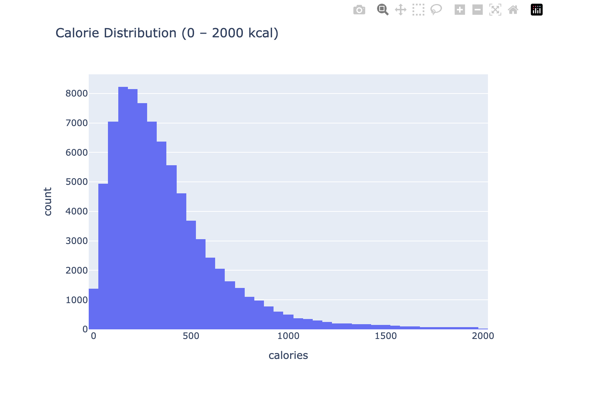
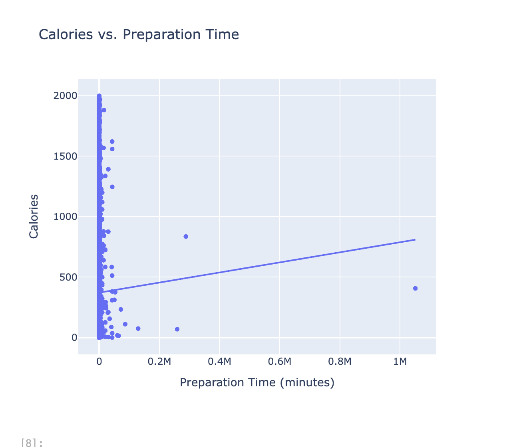
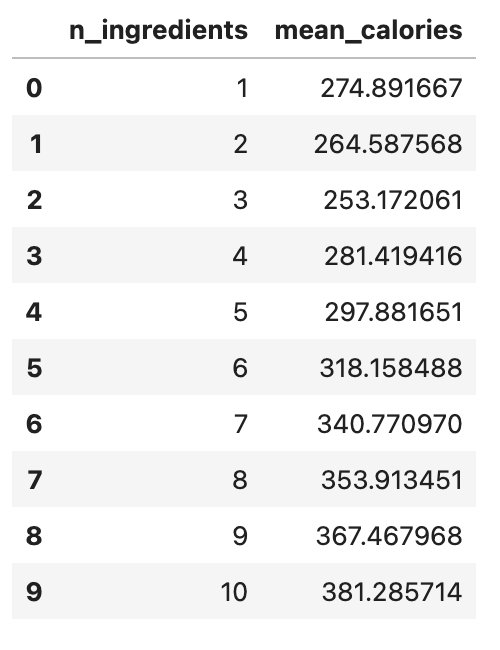
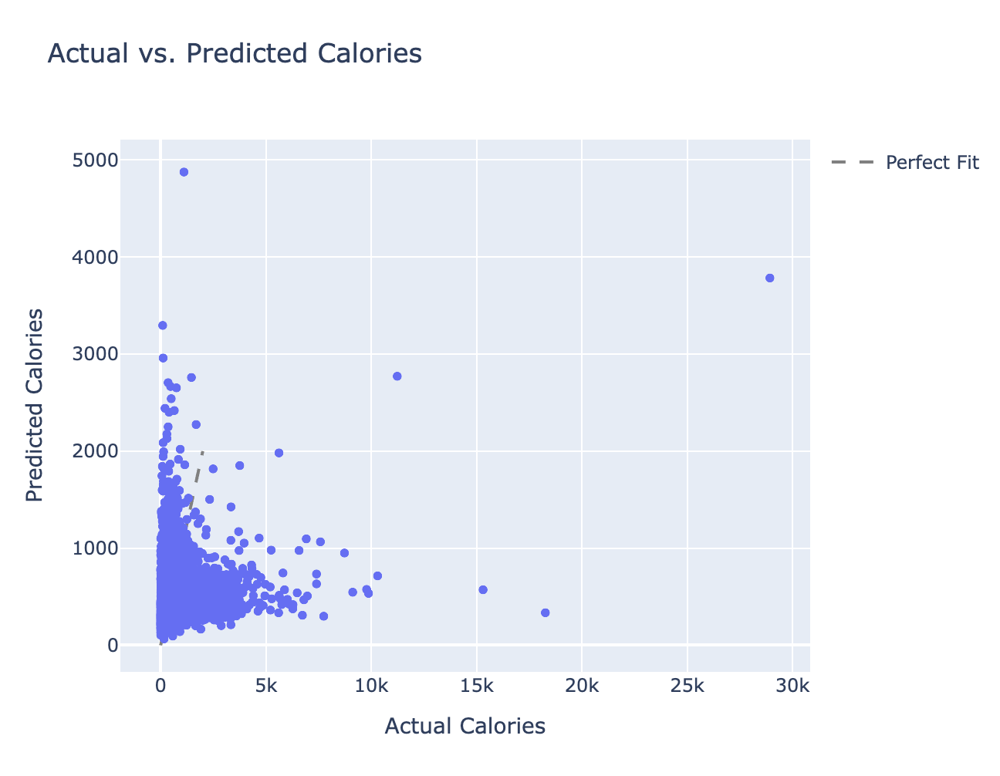

## Introduction

This project analyzes the **Recipes and Ratings** dataset to explore how recipe characteristics (e.g., prep time, ingredient count) influence **calories**. We aim to build a regression model that predicts calorie content based solely on features a user would see before cooking.

**Name:** Alyssa Rodriguez  
**Email:** alyssa@umich.edu  

---

## Data Cleaning and Exploratory Data Analysis

### Histogram of Calories

This histogram shows that most recipes fall between 100–800 kcal, though there are some high outliers, likely rich desserts or large dishes.

### Calories vs. Prep Time

This scatterplot suggests a mild positive relationship: recipes with longer prep times tend to have slightly higher calories.

### Ingredients vs. Mean Calories

This table groups recipes by number of ingredients and shows their average calorie content. The trend confirms that more ingredients generally mean more calories.

---

## Framing a Prediction Problem

We treat this as a **regression** problem: calories are a continuous value with meaningful differences (e.g., 300 vs 900 kcal).  
**Target Variable:** `calories`  
**Metric:** RMSE (Root Mean Squared Error)  
We only use features known at “time of prediction” — prep time, ingredient count, tag length, etc.

---

## Baseline Model

- **Features Used:** `minutes`, `n_steps`, `n_ingredients`, `tag_count`, `step_length_avg`  
- **Model:** Linear Regression  
- **Baseline RMSE:** 664 kcal  

---

## Final Model

- **New Features:** `minutes_per_step`, `ingredient_density`  
- **Model:** Random Forest with hyperparameter tuning (`max_depth`, `n_estimators`, `min_samples_split`)  
- **Final RMSE:** 512 kcal  

### Actual vs. Predicted Calories

This scatterplot compares the final model’s predictions to the true calorie values. Points clustered near the diagonal line indicate accurate predictions.

---

## Key Takeaways

- Recipes with more ingredients and longer instructions tend to be higher in calories.
- A simple linear model performs decently, but engineered features improve accuracy significantly (~23% better RMSE).
- This tool could help users estimate nutritional content without logging ingredients into calorie-tracking apps.
